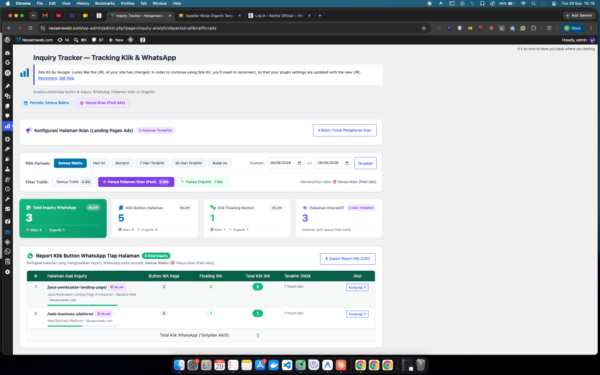

# Inquiry Tracker for WordPress

<p align="center">
  
  
  
  
</p>

<p align="center">
  <strong>Plugin WordPress mandiri (First-Party) untuk melacak klik tombol, inquiry WhatsApp, dan floating button secara real-time dengan atribusi otomatis Landing Page Iklan (Paid Ads) vs Organik.</strong>
</p>

---

## 📸 Tampilan Dashboard Aplikasi

Tampilan dashboard full-width di WP-Admin yang menyajikan analisis interaksi pengunjung, perbandingan trafik iklan vs organik, serta rincian klik per tombol dan halaman:

<p align="center">
  
</p>

---

## 🌟 Mengapa Inquiry Tracker?

Banyak bisnis dan tim marketing kesulitan mengukur efektivitas tombol WhatsApp dan Call-to-Action (CTA):
- **Google Tag Manager / GA4 Rumit**: Membutuhkan setup trigger rumit dan sering kali terblokir oleh *Ad-Blocker*.
- **Data Drop Saat Redirect WA**: Ketika pengunjung mengklik tombol WhatsApp (`wa.me`), browser langsung melakukan redirect tab, menyebabkan request AJAX standar terputus sebelum tersimpan.
- **Kebutuhan Tim Marketing**: Memerlukan data transparan mengenai **halaman iklan mana saja yang menghasilkan inquiry** dibandingkan dengan trafik organik.

**Inquiry Tracker** menyelesaikan masalah tersebut dengan pendekatan *first-party analytics* yang ringan, tahan redirect, dan langsung terintegrasi di WP-Admin tanpa biaya langganan pihak ketiga.

---

## 🚀 Fitur Unggulan

### 1. 🎯 Atribusi Halaman Iklan (Paid Ads vs Organik)
- **Field Konfigurasi Cepat**: Masukkan URL atau slug landing page iklan (1 baris per link) langsung dari dashboard.
- **Pencocokan Cerdas (Path-Based Matching)**: Pengunjung yang datang dari Facebook Ads, Google Ads, atau TikTok Ads dengan parameter query (misal `?utm_source=...`, `?fbclid=...`, `?gclid=...`) tetap otomatis teridentifikasi sebagai halaman iklan.
- **Filter Sumber Trafik**: Beralih instan antara **Semua Trafik**, **🎯 Hanya Iklan (Paid)**, atau **🌱 Hanya Organik**.
- **Labeling Visual (Badges)**: Label `🎯 IKLAN` dan `🌱 ORGANIK` disematkan pada laporan halaman, accordion tombol, dan riwayat floating WhatsApp.

### 2. 💬 Deteksi Otomatis Floating WhatsApp
- Mendeteksi elemen dengan properti CSS `position: fixed` / `position: sticky` (dengan filter otomatis agar navbar tidak salah terdeteksi).
- Kompatibel dengan semua plugin WhatsApp populer:
  - *Click to Chat* (`.ht-ctc-chat`)
  - *Joinchat* (`.joinchat`)
  - *Chaty* (`.chaty-widget`)
  - *QuadLayers* (`.qlwapp`)
  - *Buttonizer*, *NinjaTeam*, dan tombol kustom lainnya.

### 3. 🛡️ Transmisi Data Resilien & Tahan Redirect
- **URL-Encoded Blob + `navigator.sendBeacon`**: Mengatasi bug pembatalan request WebKit Safari & iOS saat redirect tab WhatsApp.
- **Fallback Bertingkat**: Otomatis fallback ke `fetch(..., { keepalive: true })` dan synchronous `XMLHttpRequest` jika browser lama tidak mendukung beacon.
- **Debounce Anti Klik Ganda (350ms)**: Mencegah penghitungan ganda akibat spam-click atau ketidaksengajaan pengunjung.
- **Bot & Crawler Filter**: Otomatis menyaring bot mesin pencari (`Googlebot`, `Bingbot`, `crawler`, dll.) dari data analitik.

### 4. 📊 Dashboard Analitik Responsif Full-Width
- **Layout Full Width**: Tampilan melebar 100% mengikuti resolusi monitor/laptop modern tanpa ruang kosong di sebelah kanan.
- **KPI Summary Cards**: Rincian total inquiry WhatsApp, klik tombol halaman, floating clicks, dan halaman aktif.
- **Filter Periode Lengkap**: Hari Ini, Kemarin, 7 Hari Terakhir, 30 Hari Terakhir, Bulan Ini, Semua Waktu, serta Custom Date Range Picker.
- **Accordion Drilldown per Halaman**: Klik nama halaman untuk melihat rincian teks tombol, CSS selector, target link, dan kontribusi persentasenya.
- **1-Click Export CSV**: File laporan ber-BOM UTF-8 (kompatibel langsung dengan Microsoft Excel & Google Sheets) yang dilengkapi kolom *Tipe Trafik*.

---

## 🛠️ Panduan Instalasi

### Cara 1: Upload File Zip (Direkomendasikan)
1. Unduh file `wp-inquiry-tracker.zip` dari repositori ini.
2. Masuk ke dashboard WordPress: **Plugins > Add New > Upload Plugin**.
3. Pilih file `wp-inquiry-tracker.zip`, klik **Install Now**, lalu klik **Activate Plugin**.
4. Menu **Inquiry Tracker** akan muncul di sidebar WP-Admin.

### Cara 2: Manual via Git / FTP
1. Clone repositori ini atau upload folder `wp-inquiry-tracker` ke direktori:
   ```bash
   wp-content/plugins/wp-inquiry-tracker
   ```
2. Aktifkan plugin melalui menu **Plugins > Installed Plugins** di WordPress Admin.

---

## 📁 Struktur Direktori

```text
├── assets/
│   └── dashboard-preview.png     # Screenshot preview dashboard
├── wp-inquiry-tracker/
│   ├── readme.txt                # Metadata resmi plugin standar WordPress
│   └── wp-inquiry-tracker.php    # Single-file core engine (v1.2.0)
├── wp-inquiry-tracker.zip        # Paket instalasi siap pasang
└── README.md                     # Dokumentasi repositori
```

---

## 📋 Changelog

### Version 1.2.0
- **Marketing Ad Pages Attribution**: Penambahan form pengaturan landing page iklan di dashboard.
- **Smart Path Matching**: Deteksi halaman iklan tahan terhadap parameter UTM, FBCLID, dan GCLID.
- **Filter Sumber Trafik**: Pilihan tampilan Semua Trafik, Hanya Iklan (Paid), atau Hanya Organik.
- **Visual Badges**: Penanda `🎯 IKLAN` vs `🌱 ORGANIK` pada laporan WA, accordion halaman, dan floating buttons.
- **Full Width Layout**: Dashboard responsif penuh tanpa batasan `max-width`.
- **CSV Export Upgrade**: Menambahkan kolom status tipe trafik.

### Version 1.1.0
- **Bulletproof Floating Detection**: Deteksi otomatis multi-plugin WhatsApp & elemen fixed/sticky.
- **Safari/WebKit Blob Fix**: Transmisi payload form-urlencoded via Blob untuk keandalan redirect WhatsApp.
- **Database Atomic Upsert**: Peningkatan efisiensi query dengan `ON DUPLICATE KEY UPDATE`.

### Version 1.0.0
- Rilis perdana plugin dengan real-time click tracking, filter periode waktu, accordion drilldown, dan ekspor CSV.

---

## 📄 Lisensi

Plugin ini dirilis di bawah lisensi [GPL-2.0 or later](https://www.gnu.org/licenses/gpl-2.0.html). Bebas digunakan dan dikembangkan untuk kebutuhan personal maupun komersial.
